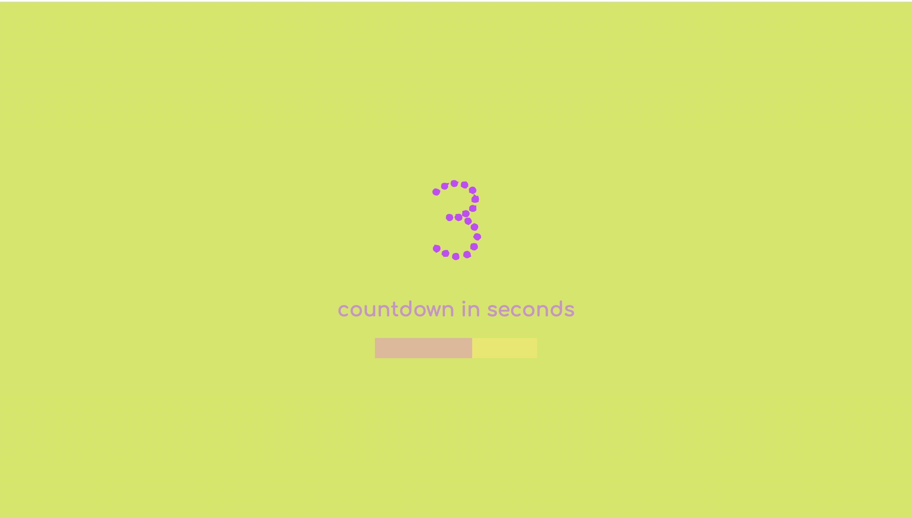
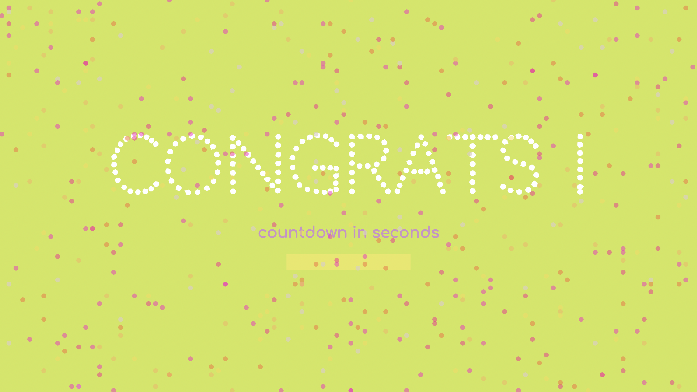

#   🎉 Countdown timer 🎉

## ✏  What's it about?

I'm counting down the time and at the end there will be surprise :) Another ocasion to practise JavaScript with loops, methods, new functions with understanding how to show it on reh screen.  

## ✏  First look 
Like You can see, it's super simply when it comes to look ( i was taking into consideration one background with gradients or some fun with CSS figures),

but in the end the power of JS is revealed !

## ✏  Technologies

+ mostly JS!

## ✏  Inspiration
This little project is part of an amazing Full Stack Developer Course created by  ♥ Ania Kubow ♥. Love this women, her sense of humor and ability to explain hard, code-things in a way that I finally understand. 🏆
You can check this course [here](https://www.codewithania.com/about) and I absolutely encourage You to visit her [YouTube](https://www.youtube.com/@AniaKubow) channel.
